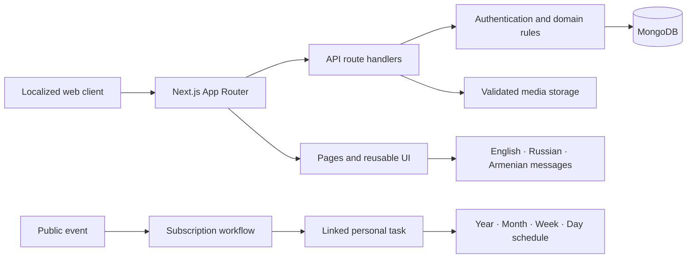

<p align="center">
  
</p>

<h1 align="center">Marker Web</h1>

<p align="center">
  A multilingual planning and social coordination platform that brings personal schedules, public events, profiles, posts, and direct conversations into one full-stack product.
</p>

<p align="center">
  Next.js 15 · React 19 · MongoDB · next-intl · SCSS Modules · OpenAPI
</p>

## Overview

Marker Web explores a product problem that ordinary calendar applications rarely solve well: planning is personal, but many plans begin with other people.

The application lets a user manage private or public tasks across year, month, week, and day views; discover community events; subscribe to an event and have it appear in their own schedule; browse another user's privacy-aware calendar; maintain a profile and network; publish task-related posts; and continue the conversation through direct messages.

This repository contains the complete product surface. The localized frontend, backend route handlers, domain rules, MongoDB access, media processing, administration interface, and interactive API documentation all live in one Next.js App Router application.

> **Project stage:** production-hardening in progress. Session security, role-based administration, rate limits, transactional writes, database indexes, request observability, health checks, CI, locale parity, and complete OpenAPI coverage are implemented. Durable object storage and deeper behavioral test coverage remain before multi-instance deployment.

## Why this project stands out
- **A connected domain, not isolated CRUD screens.** Subscribing to an event creates a linked schedule task; event changes propagate to subscribed tasks; unsubscribing and deletion clean up related records.
- **A real scheduling engine.** Daily, weekly, monthly, and one-time recurrence rules are rendered across four calendar scales, sorted by time, and summarized without double-counting overlapping time ranges.
- **Privacy-aware collaboration.** Users can inspect another person's schedule, while private task content is redacted at the API boundary for non-owners.
- **End-to-end product ownership.** The codebase includes authentication, profiles, connections, search, messaging, posts, tags, uploads, administration, localization, API documentation, and responsive UI composition.
- **Defensive content and media handling.** Rich text is sanitized with an allowlist, map URLs are restricted to supported providers, and image uploads are checked by type, count, and size with cleanup on failed writes.
- **Internationalization with regional depth.** English, Russian, and Armenian routes are supported through `next-intl`, including a bundled Armenian Montserrat font family.
- **A reusable frontend system.** Shared form controls, tabs, buttons, overlays, schedule views, layout components, SCSS modules, and global design tokens keep a large UI surface coherent.

## Product capabilities

| Area | Implemented capabilities |
| --- | --- |
| Scheduling | Task create/edit/delete, one-time and recurring tasks, privacy controls, tags, colors, rich descriptions, year/month/week/day views, workload summaries |
| Events | Public event feed, title and tag filtering, event media, supported map links, subscription lifecycle, subscriber metadata |
| Network | User search, follow/unfollow connections, embedded profiles, shared schedules with private-field redaction |
| Messaging | Authenticated one-to-one text conversations, cursor-style history pagination, own-message editing, scroll-position preservation |
| Content | Posts linked to owned tasks, rich-text descriptions, multi-image upload, ownership checks, edit and delete flows |
| Profiles | Public profile data, configurable preferences, favorite tags with usage tracking, profile image upload |
| Administration | Searchable and paginated user/event management, event CRUD, profile image management, homepage slider configuration |
| Platform | Locale-aware routing, reusable UI primitives, MongoDB connection reuse, Swagger UI, OpenAPI consistency script |

## Architecture



Important architectural choices:

- **App Router as the full-stack boundary:** UI and HTTP endpoints share the same deployment unit and import aliases.
- **Server-enforced ownership:** write operations match both the resource ID and authenticated user ID where ownership matters.
- **Domain serialization:** MongoDB identifiers and related tag/user documents are normalized before reaching the client.
- **Reusable schedule rendering:** the same calendar views support both a user's own workspace and a connection's shared schedule.
- **Feature synchronization:** lightweight browser events refresh schedule widgets when event subscriptions or tasks change.

## Technology

| Layer | Technology | Role in Marker |
| --- | --- | --- |
| Application | Next.js 15, React 19 | App Router pages, server endpoints, client interactions |
| Data | MongoDB Node.js driver | Users, sessions, tasks, events, posts, messages, and tags |
| Authentication | bcryptjs, opaque cookie sessions, MongoDB | Password hashing, server-side session lifecycle, and role enforcement |
| Localization | next-intl | Locale routing and translated interface messages |
| UI | SCSS Modules, Sass, Swiper, clsx | Component-scoped styling, responsive layout, carousel behavior || Content | TinyMCE, custom sanitizer | Rich task, event, and post descriptions |
| HTTP/API | Fetch, Axios, OpenAPI, Swagger UI | Client requests, documented backend surface, interactive API explorer |

## Repository map

```text
marker-web/
├── messages/                    # English, Russian, and Armenian catalogs
├── public/                      # Logos, fonts, sprites, and runtime upload roots
├── scripts/                     # Repository quality checks
├── src/
│   ├── app/
│   │   ├── [locale]/            # Localized product and admin pages
│   │   ├── api/                 # Full-stack HTTP route handlers
│   │   ├── api-doc/             # Interactive Swagger UI
│   │   ├── components/          # Shared UI, widgets, forms, and overlays
│   │   └── lib/                 # MongoDB, API, sanitization, and map utilities
│   ├── i18n/                    # Locale routing and request configuration
│   ├── models/                  # Domain document constructors
│   └── middleware.js            # Locale negotiation and routing middleware
└── docs/PORTFOLIO_REVIEW.md     # Recruiter and technical-lead assessment
```

## Getting started

### Prerequisites

- Node.js 20 or a newer LTS release
- npm
- A local or hosted MongoDB instance

### Installation

```bash
git clone <your-repository-url>
cd marker-web
npm install
cp .env.example .env.local
npm run dev
```

Set a unique, high-entropy `JWT_SECRET` before starting the application. The example MongoDB URI targets a local development database.

Open these routes after the server starts:

- Product: `http://localhost:3000/en`
- Other locales: `http://localhost:3000/ru` and `http://localhost:3000/arm`
- Interactive API documentation: `http://localhost:3000/api-doc`
- Admin entry point: `http://localhost:3000/en/admin/login`

## Available scripts

| Command | Purpose |
| --- | --- |
| `npm run dev` | Start the Turbopack development server |
| `npm run build` | Create an optimized production build |
| `npm run start` | Serve the production build |
| `npm run lint` | Run the repository's Next.js lint command |
| `npm run swagger:check` | Compare implemented API route handlers with the OpenAPI specification |\n| `npm run quality:check` | Run security, OpenAPI, locale-parity, and operations checks |\n| `npm run locales:check` | Ensure all locale catalogs expose the same keys |\n| `npm run operations:check` | Ensure every API route uses the observability wrapper |

## API surface

The backend contains authenticated product APIs plus dedicated liveness and readiness handlers across **36 route modules**. They cover authentication, users, profiles, connections, messages, tasks, tags, posts, events, subscriptions, uploads, and administration.

- Source specification: [`src/app/lib/swagger/openapi.json`](./src/app/lib/swagger/openapi.json)- Interactive renderer: [`src/app/api-doc`](./src/app/api-doc)
- Consistency check: [`scripts/check-swagger.cjs`](./scripts/check-swagger.cjs)

The OpenAPI document covers every implemented route module and is enforced by the repository consistency check.

## Data and security behavior

- Passwords are hashed with bcrypt before persistence.
- Authenticated endpoints resolve hashed opaque cookie sessions through the session collection.
- Resource identifiers are validated before conversion to MongoDB `ObjectId` values.
- Owned tasks and posts are checked before update or deletion.- Private task details are stripped when another user requests a schedule.
- Rich HTML accepts a narrow tag/style allowlist and safe HTTP(S) links.
- Post and event uploads accept JPG, PNG, WEBP, and GIF files, with a four-image and 5 MB-per-image limit.
- API projections avoid returning password hashes in user-facing responses.

Security-critical authentication, role authorization, rate limiting, validation, migrations, and operational checks are implemented. Before horizontal or ephemeral deployment, move uploads to durable object storage and expand behavioral integration/end-to-end coverage.

## Engineering roadmap
1. Replace prototype admin authentication with session-backed role-based authorization and remove all credential fallbacks.
2. Add unit tests for recurrence, privacy redaction, sanitization, and tag accounting; add integration tests for subscription workflows.
3. Add Playwright coverage for the sign-up → task → event subscription → shared schedule journey.
4. Add CI for lint, tests, build, and OpenAPI parity.
5. Complete the four missing OpenAPI route groups and two missing translated header keys.
6. Move uploaded media to object storage and add database indexes, observability, rate limits, and deployment configuration.

## Portfolio review

For an evidence-based evaluation of the project from both hiring-manager and technical-lead perspectives—including resume bullets, interview talking points, the strongest engineering decisions, and prioritized gaps—read [docs/PORTFOLIO_REVIEW.md](./docs/PORTFOLIO_REVIEW.md).
