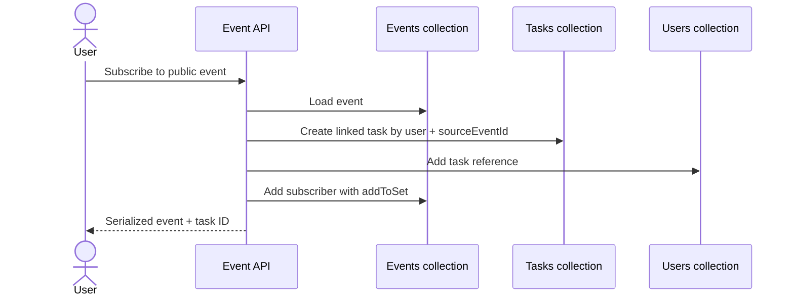

# Marker Web — Portfolio Review

_Repository audit performed on 22 July 2026._

## Executive assessment

Marker Web is a strong full-stack portfolio project because it demonstrates more than framework familiarity. It models a connected product domain in which schedules, community events, subscriptions, profiles, messages, posts, privacy, media, and administration influence one another.

From a recruiter's perspective, the breadth signals the ability to take a product from idea to a functioning MVP. From a technical lead's perspective, the best evidence is in the cross-feature rules: an event subscription creates a linked personal task, changes to an event are propagated to its subscriber tasks, private task data is redacted for other viewers, recurring work is resolved across multiple calendar views, and tag usage is maintained as related data changes.

The repository is best presented as an **ambitious, working portfolio MVP with clear production-hardening priorities**. Calling it production-ready would weaken the story because authentication hardening, automated tests, CI, and some documentation parity are still incomplete.

## Audit snapshot

| Signal | Verified repository evidence |
| --- | ---: |
| Application source files (`.js`, `.scss`, `.json`) | 196 |
| Approximate JS/SCSS/JSON source lines | 19,483 |
| JavaScript files | 133 |
| SCSS files | 58 |
| API route modules | 31 |
| Exported HTTP handlers | 34 |
| Localized page entry points | 15 |
| Shared component JavaScript files | 31 |
| OpenAPI operations | 27 |
| OpenAPI schemas | 24 |
| English message leaves | 260 |
| Russian / Armenian message leaves | 258 each |
| SCSS media-query declarations | 46 |
| ARIA/role occurrences in JSX | 36 |

Counts describe scale, not quality. The strongest evidence comes from the implemented behaviors below.

## Strongest portfolio signals

### 1. End-to-end product thinking

Marker is designed around a coherent user journey rather than a collection of demo pages:

1. A user registers and receives an authenticated session.
2. They create one-time or recurring tasks and inspect them at different calendar scales.
3. They discover public events by title or tag.
4. Subscribing creates a task linked to that event in their schedule.
5. They can connect with people, view privacy-safe schedules and profiles, and exchange messages.
6. A task can become the context for a rich post with media.
7. Administrators can manage events, subscriber propagation, and user settings.

This breadth is valuable because it demonstrates feature integration, data ownership, navigation design, state management, API work, and persistence in one project.

### 2. Non-trivial scheduling logic

The scheduling implementation has genuine domain logic:

- One-time, daily, weekly, and monthly task matching.
- Year, month, week, and day presentations built on shared date utilities.
- Monday-based week calculation and fixed six-week month grids.
- Time parsing for 12-hour and 24-hour input.
- Chronological task sorting.
- Workload calculation that merges overlapping intervals before totaling hours.
- Responsive behavior that adjusts available views on smaller screens.

This is a better technical discussion topic than simple CRUD because it includes boundary conditions, recurrence semantics, date representation, derived data, and reusable visualization components.

### 3. Event-to-schedule synchronization

The event subscription workflow is the clearest architectural highlight.

The inverse flow removes linked tasks on unsubscribe. Admin event edits update all tasks carrying the event's `sourceEventId`, while event deletion removes those tasks and cleans user references. This demonstrates attention to consistency across denormalized MongoDB documents.

### 4. Privacy at the API boundary

When a user views another person's schedule, private tasks are not merely hidden with CSS. The server serializer clears the title, description, location, tags, media, and color for non-owners while preserving enough timing information to show availability.

That is a strong design choice: the client never receives private content it is not allowed to display. It is a concrete example of treating authorization and privacy as backend responsibilities.

### 5. Defensive handling of user-generated content

The project contains several pragmatic safety layers:

- Rich text is normalized through a tag allowlist.
- Script, style, iframe, form, and embedded-object content is removed.
- Link protocols are limited to HTTP(S), with `noopener noreferrer` on new tabs.
- Inline styles are limited to validated foreground/background colors.
- Google Maps and Yandex Maps URLs are validated by protocol, hostname, and path.
- Media files are restricted by MIME type, count, and size.
- Partial file writes are cleaned up after failures.
- Password fields are excluded from relevant MongoDB projections.

These choices show awareness of XSS, unsafe URLs, uncontrolled uploads, partial failures, and sensitive-field exposure.

### 6. Thoughtful messaging pagination

Direct messaging is more complete than a typical portfolio mockup:

- Conversations are scoped to the authenticated user and selected recipient.
- History uses a `before` timestamp and bounded page size.
- Results are loaded newest-first in MongoDB, then reversed for conversation display.
- Duplicate records are suppressed when older pages are prepended.
- Scroll position is preserved while older messages load.
- Only the original sender can edit a message.

This is good evidence of coordinating API pagination with detailed client UX behavior.

### 7. Internationalization and regional awareness

Locale-aware routing, request configuration, navigation helpers, and three message catalogs are integrated into the app structure. Armenian support is more than a label switch: a complete Armenian Montserrat font family is bundled with the product.

For hiring teams, this signals experience with route-level internationalization, translation catalogs, locale persistence, and typography constraints that are easy to miss in English-only projects.

### 8. Reusable UI and responsive design

The project includes shared buttons, inputs, selectors, date and recurrence controls, rich-text input, tabs, confirmation dialogs, popup infrastructure, network widgets, schedule views, and administration primitives. Component-scoped SCSS and global tokens provide a consistent visual vocabulary.

The repository contains 46 media-query declarations and explicit viewport-aware schedule behavior. Accessibility work has begun through labels, semantic forms/buttons, alt text, and ARIA attributes, giving the project a reasonable base for a formal accessibility pass.

### 9. Administration and operational thinking

The admin application is a separate route group with reusable shell and form components. It supports:

- Debounced user search and paginated/infinite lists.
- Editing account fields and preference flags.
- Password hashing for administrator-triggered password changes.
- Profile image updates.
- Searchable, paginated event management.
- Event updates that propagate to subscribers.
- Homepage slider configuration and previews.

The authentication mechanism is currently a prototype and must be replaced, but the existence of an operational surface shows product thinking beyond the end-user happy path.

### 10. API discoverability

Marker includes an OpenAPI document, 24 reusable schemas, a server-rendered Swagger page, an interactive Swagger UI, and a repository script that compares route modules with the specification.

The consistency script currently catches real drift, which proves that it is useful: it reports four implemented route groups missing from the specification. Completing those entries and running the check in CI would turn the current foundation into a strong delivery-quality signal.

## Competency evidence matrix

| Competency | Evidence in Marker | Hiring signal |
| --- | --- | --- |
| Product engineering | Calendar, events, network, profiles, posts, chat, and admin form connected journeys | Can reason beyond tickets and individual screens |
| Frontend architecture | Reusable controls, popup provider, shared calendar views, responsive route layouts | Can organize a substantial React UI |
| Backend development | 34 handlers, authentication context, ownership checks, serialization, validation | Can implement and protect application APIs |
| Data modeling | Linked tasks/events, references on users, tags with usage counts, session documents | Understands document relationships and denormalization tradeoffs |
| Algorithms | Recurrence matching, month/week construction, overlap merging, cursor pagination | Can implement domain logic beyond library calls |
| Security awareness | bcrypt, server-side privacy redaction, rich-text sanitization, file constraints | Recognizes important application threats |
| Internationalization | Three locale routes/catalogs and Armenian typography assets | Can build for multiple regions and scripts |
| Developer experience | Import aliases, shared libraries, Swagger UI, API consistency script | Values maintainability and discoverability |

## Verified maturity audit

### Strong and demonstrable now

- Broad, coherent full-stack feature set.
- Meaningful calendar and synchronization domain logic.
- Consistent use of MongoDB ownership filters on key write paths.
- Server-side privacy redaction for shared schedules.
- Pagination in messaging and administration views.
- Reusable UI primitives and responsive layouts.
- Three-locale infrastructure and extensive translation catalogs.
- Rich-text, URL, identifier, and upload validation.
- Interactive API documentation foundation.

### Portfolio-stage gaps

| Priority | Finding | Why a technical lead will care | Recommended action |
| --- | --- | --- | --- |
| P0 | Admin login credentials and authorization header value are hard-coded in source | Anyone who can inspect the client/source can obtain admin access | Replace with database-backed users, hashed credentials, server sessions, and role checks |
| P0 | JWT signing uses a fallback secret | A missing environment variable silently creates predictable tokens | Require `JWT_SECRET` at startup and rotate any previously issued sessions |
| P1 | No automated test suite or CI workflow | Core recurrence, privacy, and cascading-data behavior can regress unnoticed | Add unit, route integration, and Playwright tests; enforce them in GitHub Actions |
| P1 | OpenAPI parity check reports four missing paths | Interactive documentation does not yet describe the whole API | Document admin events plus event subscribe, unsubscribe, and delete routes |
| P1 | Uploads are written to local `public/uploads` | Local files are not durable across many serverless/container deployments | Use S3-compatible object storage and persist immutable asset URLs |
| P2 | Russian and Armenian catalogs each miss two English header keys | Locale fallback or missing-label behavior may appear in navigation | Add `Global.header.Network` and `Global.header.profile` to both catalogs |
| P2 | Validation and authentication patterns are duplicated across route groups | Fixes can be applied inconsistently | Centralize session resolution, response errors, schemas, and domain services |
| P2 | No database index/migration documentation | Search and relationship lookups may slow as data grows | Define indexes for login/email, session token, task/event ownership, source event, messages, and tags |
| P2 | No rate limiting, observability, or deployment runbook | Abuse and production incidents would be difficult to control | Add rate limits, structured logs, health checks, monitoring, and deployment docs |

### Verification note

The repository's OpenAPI check was executed during the audit and correctly failed on these missing paths:

- `/api/admin/events`
- `/api/event/delete-event`
- `/api/event/subscribe-event`
- `/api/event/unsubscribe-event`

A production build was also attempted from the audit environment. Compilation could not begin because the available Windows Node runtime was pointed at Linux-installed dependencies through a UNC path and Next.js could not invoke npm to obtain the matching Windows SWC package. This is an audit-host limitation, not evidence of either a passing or failing application build. The build should be rerun inside the repository's native Linux/WSL environment.

## How to present Marker in an interview

### 60-second project pitch

> Marker is a multilingual full-stack planning platform built with Next.js, React, and MongoDB. I designed it around the idea that personal schedules and social events should work together: users manage recurring private tasks, discover public events, subscribe to place them in their own calendars, view connections' availability without exposing private details, and communicate through direct messages. The most interesting engineering work is the recurrence engine, server-side privacy redaction, linked event-to-task synchronization, sanitized rich content and media handling, and the reusable calendar UI across year, month, week, and day views. It is currently a portfolio MVP, and I have a concrete roadmap for role-based admin security, tests, CI, object storage, and observability.

### Suggested live demo

1. Register and create a weekly recurring private task.
2. Show the same data in month, week, and day views.
3. Open the public event feed, filter by a tag, and subscribe.
4. Return to the schedule and show the linked event task.
5. Open a connection's schedule and show how private details are redacted.
6. Send and edit a message, then load older conversation history.
7. Finish in Swagger UI and explain the OpenAPI consistency check and roadmap.

### Technical questions worth inviting

- Why are subscribed events copied into tasks instead of joined at read time?
- How does the application avoid exposing private task fields?
- How are overlapping task durations calculated?
- What happens to subscriber tasks after an event changes or is deleted?
- Why use cursor-style pagination for messages and offset pagination for admin lists?
- How would local uploads and session storage change for a horizontally scaled deployment?
- Which logic would receive unit, integration, and end-to-end coverage first?

## Resume-ready bullets

Adapt the wording to match personal contribution and measured results:

- Built a multilingual full-stack planning and social coordination application with Next.js 15, React 19, MongoDB, and `next-intl`, spanning 34 HTTP handlers and 15 localized page entry points.
- Designed a reusable four-scale calendar with daily, weekly, monthly, and one-time recurrence rules plus overlap-aware workload calculations.
- Implemented an event subscription lifecycle that creates linked personal tasks and propagates event updates and deletions across subscriber schedules.
- Enforced privacy and ownership at the API layer through authenticated session lookups, owner-scoped writes, private-field redaction, password projections, and input validation.
- Added direct messaging with bounded history pagination, scroll preservation, and sender-only edits, alongside profiles, user discovery, connections, and shared schedules.
- Developed rich-content and media pipelines with HTML allowlisting, safe-link normalization, upload constraints, failure cleanup, and task-linked posts.
- Created a reusable SCSS-module component system, responsive calendar behavior, three locale catalogs, Armenian typography support, and interactive OpenAPI documentation.

## Best next investments

For the greatest improvement in hiring impact, complete work in this order:

1. **Security hardening:** fix admin authorization and require secrets.
2. **Tests and CI:** make the most interesting domain behavior demonstrably reliable.
3. **Visual proof:** add a hosted demo plus desktop/mobile screenshots or a 60-second walkthrough.
4. **API and locale parity:** make the existing quality checks pass.
5. **Deployment architecture:** add object storage, indexes, observability, and a repeatable deployment path.

Those changes would move Marker from an impressive feature-rich MVP to a portfolio project that also demonstrates production discipline.
